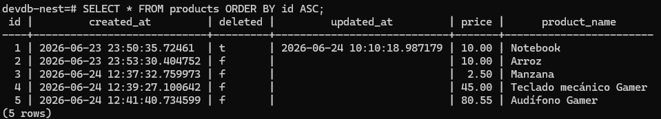

## Flujo de Datos y Arquitectura

---

### 1. Flujo de Ida (Guardar o Actualizar)
1. **Cliente (API REST):** **Bruno** envía los datos del producto estructurados en un formato JSON.
2. **Procesamiento:** **Spring Boot** recibe el JSON, ejecuta las validaciones correspondientes y lo transforma en una Entidad de JPA.
3. **Auditoría Automática (BaseEntity):** Antes de persistir en la base de datos, la clase padre intercepta el ciclo de vida:
    * **Si es un producto nuevo:** Asigna la fecha actual a created_at y define deleted como false por defecto.
    * **Si es una actualización / borrado lógico:** Asigna la fecha actual a updated_at y cambia el estado de deleted a true (en caso de eliminación).
4. **Persistencia:** **PostgreSQL (Docker)** recibe la instrucción SQL generada por Hibernate y guarda o actualiza la fila físicamente en la tabla.

---

### 2. Flujo de Vuelta (Consultar)
1. **Lectura:** **PostgreSQL (Docker)** recupera las filas de la tabla con todas sus columnas (id, campos de auditoría y negocio) y las transfiere a la aplicación.
2. **Mapeo:** **BaseEntity** se encarga de heredar de forma automática las columnas de control (created_at, updated_at, deleted). Esto permite al backend aplicar lógica de negocio, como filtrar los productos que tienen el estado de borrado lógico activo.
3. **Transformación:** **Spring Boot** procesa la entidad y la transforma en un DTO limpio, exponiendo únicamente la información necesaria hacia el exterior.
4. **Respuesta:** **Bruno** recibe el JSON final estructurado y lo renderiza en la interfaz de usuario.

