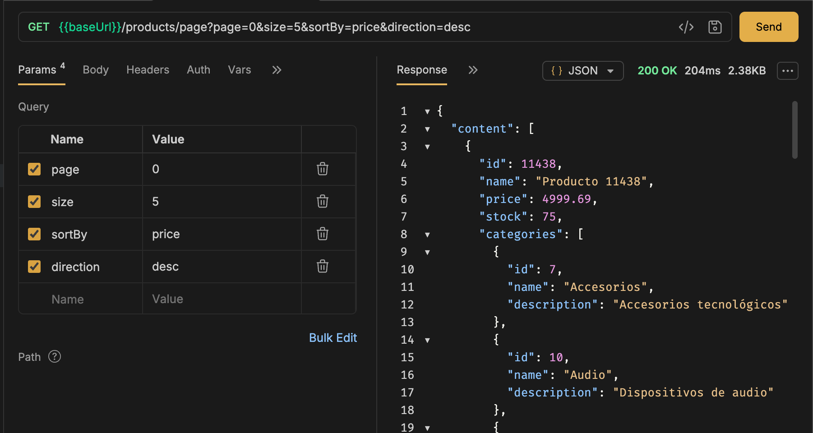
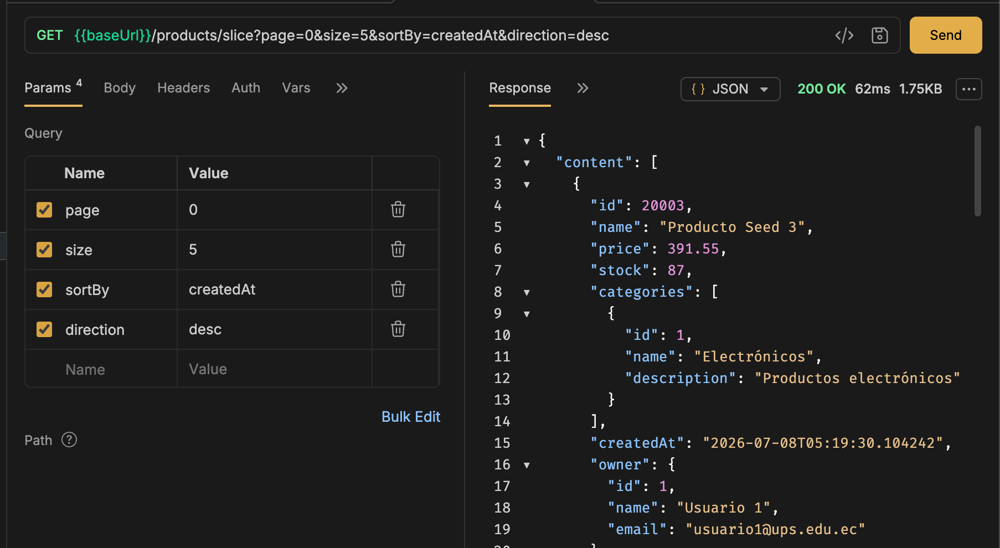
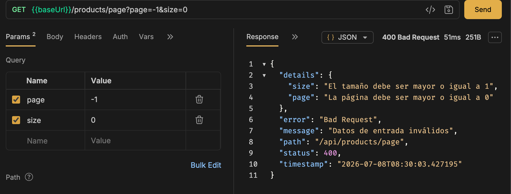
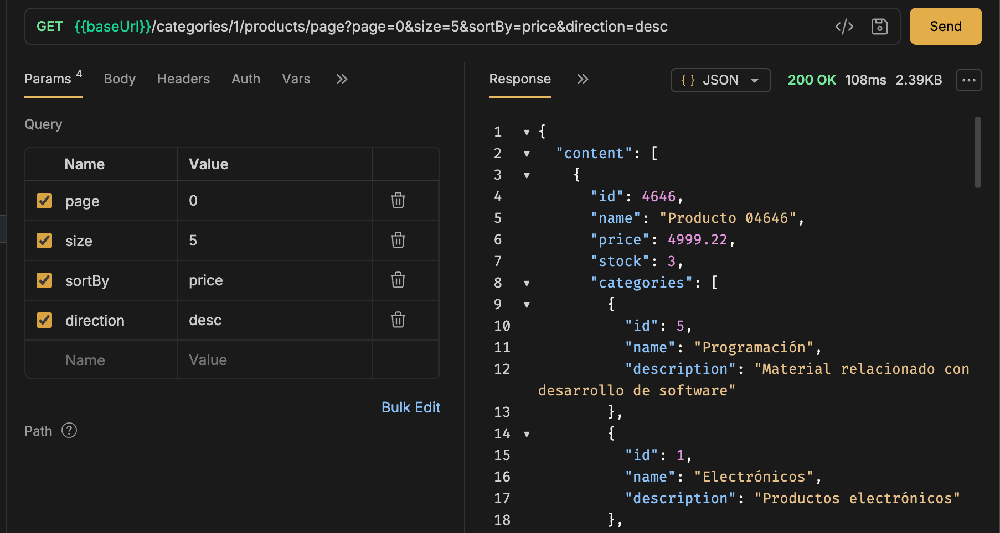
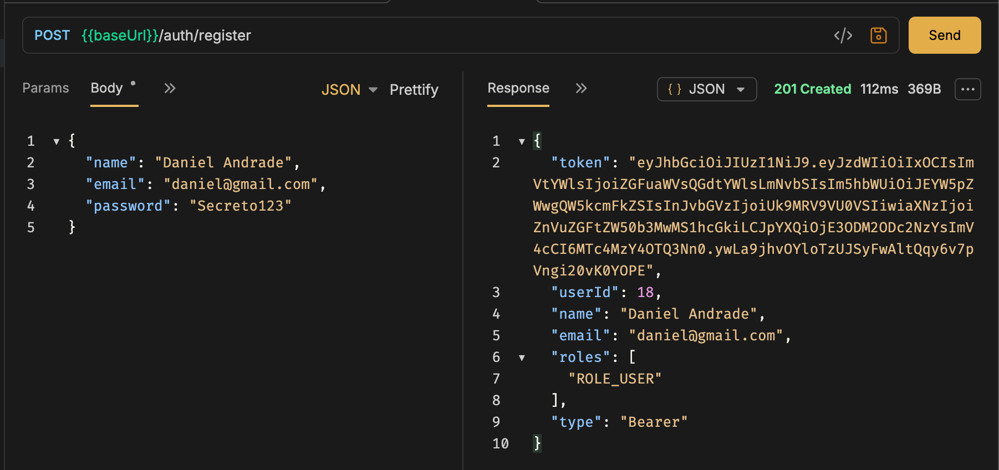
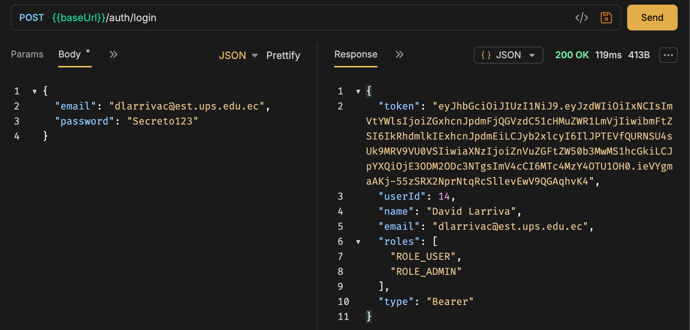
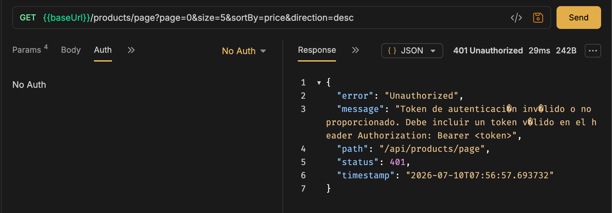
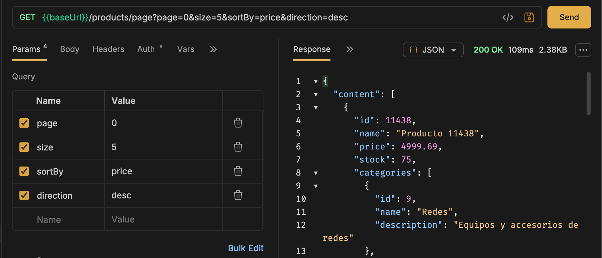
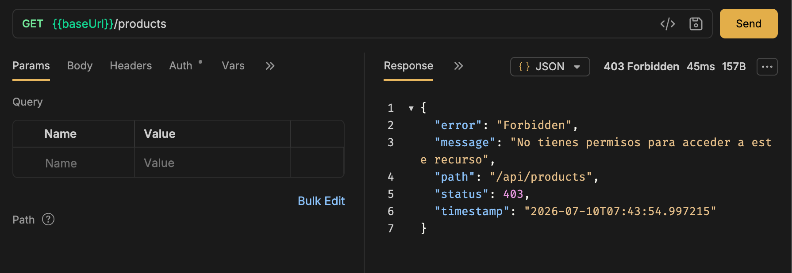
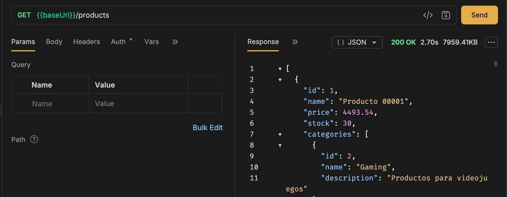

# Prácticas Spring Boot - fundamentos01

Proyecto de la materia Programación y Plataformas Web (UPS).

## Datos del proyecto

- Group: `ec.edu.ups.icc`
- Artifact: `fundamentos01`
- Java 25
- Gradle (Groovy)
- Spring Boot 4.1.0
- Dependencias:
   - Spring Web
   - Spring Boot DevTools

## Ejecutar el proyecto

```bash
./gradlew bootRun
```

# Práctica 01 - Configuración

## Objetivo

Configurar el proyecto y comprobar que spring funciona correctamente.

### Endpoint

```text
GET http://localhost:8080/api/api/status
```

# Práctica 02 - Estructura del proyecto

## Objetivo

Organizar la estructura del proyecto por paquetes y crear el módulo **students**.

### Endpoints

```text
GET /api/students
GET /api/students/count
```

Respuesta esperada:
```json
[
{
"id": 1,
"name": "Isaac",
"age": "23"
},
{
"id": 2,
"name": "Juan",
"age": "30"
}
]
```

# Práctica 03 - Implementación de API REST

## Objetivo
Desarrollar una interfaz de programación (API) funcional siguiendo el paradigma REST para gestionar las entidades **users** y **products**. Se aplicaron patrones de diseño para separar las capas de datos, lógica y comunicación, utilizando DTOs, modelos y clases de mapeo. En esta etapa, el almacenamiento es volátil (en memoria).

## Rutas de acceso (Endpoints)

### Usuarios (Users)

| Método | Recurso |
|---------|------|
| GET | `/api/users` |
| GET | `/api/users/{id}` |
| POST | `/api/users` |
| PUT | `/api/users/{id}` |
| PATCH | `/api/users/{id}` |
| DELETE | `/api/users/{id}` |

*La gestión de **productos** sigue el mismo esquema, reemplazando el segmento `/users` por `/products`.*

## Ejemplo: Registro de Usuario

```http
POST /api/users
```

## Petición 
```json
{
"name": "Ana",
"email": "ana@ups.edu.ec",
"password": "1234"
}
```

## Respuesta exitosa
```json
{
  "id": 1,
  "name": "Ana",
  "email": "ana@ups.edu.ec"
}
```

## Respuesta ante un error (Usuario inexistente)
```json
{
  "message": "No se localizó el usuario con identificador 99"
}
```

## Ejemplo de respuesta con un objeto producto
```json
{
  "id": 1,
  "name": "Teclado",
  "price": 25.5,
  "stock": 10
}
```

```
users/
├── controllers/UserController.java   # Manejo de peticiones HTTP
├── dtos/                             # Objetos de transferencia de datos
├── models/UserModel.java             # Definición del modelo de negocio
└── mappers/UserMapper.java           # Conversión entre modelos y DTOs```
```
El módulo de Objetos replica la misma estructura.

# Práctica 04 - Refactorización de la lógica (Controladores y Servicios)

## Objetivo
El propósito de esta fase fue implementar una separación clara de responsabilidades en la aplicación. Hemos extraído la lógica de negocio que residía en los controladores para trasladarla a una nueva capa intermedia: los **Servicios**. Con este cambio, el controlador actúa únicamente como un punto de entrada para las peticiones HTTP, delegando todas las operaciones y reglas de negocio a la capa de servicios.

## Ejemplo: Controlador optimizado
Ahora, el controlador se mantiene limpio, limitándose a inyectar y llamar a los métodos del servicio:

```java
@RestController
@RequestMapping("/users")
public class UserController {

    private final UserService userService;

    // Inyección de dependencia a través del constructor
    public UserController(UserService userService) {
        this.userService = userService;
    }

    @GetMapping
    public List<UserResponseDto> findAll() {
        // El controlador solo delega la tarea al servicio y retorna el resultado
        return userService.findAll();
    }
}
```

## Nueva Arquitectura de paquetes
La estructura interna se ha reorganizado para reflejar esta división de capas, permitiendo un código más escalable y fácil de probar:

```
users/
├── controllers/              # Gestión exclusiva de endpoints HTTP
├── services/                 # Lógica de negocio y procesamiento
│   ├── UserService.java      # Interfaz de contrato
│   └── UserServiceImpl.java  # Implementación de la lógica
├── dtos/                     # Objetos de transferencia
├── models/                   # Definición de datos
└── mappers/                  # Conversión de objetos
```
Esta misma distribución lógica se aplicó también al módulo products, asegurando consistencia en todo el proyecto.

Los endpoints son los mismos de la práctica anterior.

# Práctica 05 - Persistencia de Datos (PostgreSQL y JPA)

## Objetivo
Migrar el almacenamiento de información desde la memoria volátil hacia una base de datos relacional robusta (**PostgreSQL**), utilizando **Spring Data JPA** como capa de abstracción para gestionar la persistencia de forma eficiente.

## Configuración del Entorno
- Se desplegó un contenedor de **Docker** para gestionar la instancia de PostgreSQL.
- Se configuraron los parámetros de conexión en el archivo `application.yml`.
- Se integraron las dependencias necesarias de JPA y el conector de PostgreSQL al proyecto.

## Estructura de Persistencia
Se introdujo una nueva capa de datos para representar las tablas del sistema:

```text
core/
└── entities/BaseEntity.java       # Campos comunes (ID, fechas, etc.)

users/
├── entities/UserEntity.java       # Mapeo a la tabla de usuarios
└── repositories/UserRepository.java # Interfaz de acceso a datos (Spring Data)
```
El componente UserMapper fue ajustado para manejar la conversión entre los Modelos de negocio y las Entidades de base de datos.

## Actualización en la Capa de Servicios
La lógica de negocio dejó de operar sobre colecciones en memoria. Ahora, los servicios dependen de los repositorios para realizar operaciones CRUD persistentes:

```java
private final UserRepository userRepository;

public UserServiceImpl(UserRepository userRepository) {
    this.userRepository = userRepository;
}
```

- Los métodos del servicio emplean save(), findById() y findAll() para comunicarse con la base de datos.

- Se implementó la estrategia de borrado lógico, marcando registros como eliminados mediante el campo deleted en lugar de borrarlos físicamente.

## Verificación de Datos
```text
docker exec -it postgres-dev psql -U ups -d devdb -c "SELECT * FROM users;"
```

# Práctica 06 - Integridad y Validación de Datos (DTOs)

## Objetivo
Garantizar la calidad y coherencia de la información que ingresa al sistema mediante reglas de validación aplicadas directamente sobre los **DTOs**. Esto impide que datos incorrectos o incompletos lleguen a la capa de persistencia.

## Integración del Starter
Se incorporó la dependencia `spring-boot-starter-validation` para aprovechar las anotaciones estándar de Hibernate Validator, facilitando la creación de reglas de validación declarativas.

## Reglas de Validación
Se aplicaron restricciones en los DTOs para asegurar que los campos cumplan con el formato esperado:

**Ejemplos de restricciones en DTOs:**
```java
// Validación para usuarios
@NotBlank(message = "El nombre es obligatorio")
@Size(min = 3, max = 150)
private String name;

@NotBlank(message = "El email es obligatorio")
@Email(message = "Debe ingresar un email válido")
private String email;

// Validación para productos
@Min(0)
private Double price;

@Min(0)
private Integer stock;
```

## Activar la validación
```java
@PostMapping
public UserResponseDto create(@Valid @RequestBody CreateUserDto dto) {
    return userService.create(dto);
}
```

### Validaciones de lógica de negocio (Service)
A diferencia de las validaciones de formato (que se hacen en el controlador con @Valid), las reglas de negocio que requieren consultar la base de datos se implementan mediante lógica manual dentro del servicio:

```java
@Override
public UserResponseDto create(CreateUserDto dto) {
  // Validar si el email ya está en uso antes de guardar
  if (userRepository.findByEmail(dto.getEmail()).isPresent()) {
    throw new ConflictException("Email already registered");
  }

  // ... aquí iría tu lógica para guardar y retornar el objeto ...
  return response;
}
```

# Práctica 07 - Gestión centralizada de errores

## Objetivo
Implementar un mecanismo unificado para el manejo de errores en toda la API. En lugar de retornar errores genéricos o lanzar excepciones de Java estándar (como `IllegalStateException`), centralizamos la respuesta del sistema para que el cliente siempre reciba una estructura JSON consistente, independientemente de dónde ocurra el fallo.

## Estructura del paquete de excepciones
Hemos organizado los errores para separar la lógica de captura del manejo específico de cada caso de negocio:

```text
core/exceptions/
├── base/ApplicationException.java       # Excepción base personalizada
├── domain/                              # Excepciones específicas de negocio
│   ├── NotFoundException.java
│   ├── ConflictException.java
│   └── BadRequestException.java
├── response/ErrorResponse.java          # Formato estandarizado del JSON de error
└── handler/GlobalExceptionHandler.java  # Capturador global (@ControllerAdvice)
```

## Handler
El componente GlobalExceptionHandler intercepta las excepciones lanzadas por la capa de servicio y las transforma en una respuesta HTTP estructurada:
```java
@ExceptionHandler(ApplicationException.class)
public ResponseEntity<ErrorResponse> handleApplicationException(
        ApplicationException ex,
        HttpServletRequest request) {

  return ResponseEntity.status(ex.getStatus())
          .body(new ErrorResponse(
                  ex.getStatus(),
                  ex.getMessage(),
                  request.getRequestURI()));
}
```

También se han configurado manejadores adicionales para MethodArgumentNotValidException (errores de validación) y excepciones generales.

## Mejora en la capa de Servicios
Ahora, en lugar de lanzar errores genéricos, los servicios lanzan excepciones específicas de nuestro dominio. Por ejemplo, en los métodos de búsqueda:

```java
// Antes
throw new IllegalStateException("User not found");

// Ahora
.orElseThrow(() -> new NotFoundException("User not found"));
```

## Pruebas de funcionamiento
```bash
# 1. Error de validación (datos incompletos/incorrectos)
curl -X POST localhost:8080/api/products \
-H "Content-Type: application/json" \
-d '{"name":"","price":-5,"stock":-1}'

# 2. Conflicto de negocio (ej. producto ya existente)
curl -X POST localhost:8080/api/products \
-H "Content-Type: application/json" \
-d '{"name":"laptop","price":800,"stock":5}'

# 3. Recurso no encontrado
curl localhost:8080/api/products/999
```

# Práctica 08 - Modelado de Relaciones

## Objetivo
Establecer la estructura relacional de la base de datos vinculando las entidades **products**, **users** y **categories**. Con esto, permitimos que un producto sea propiedad de un usuario y pertenezca a una categoría específica, garantizando la integridad referencial.

## Nuevo Módulo: Categorías
Se añadió un nuevo componente para gestionar las categorías siguiendo la arquitectura ya establecida:

```text
categories/
├── controllers/
├── dtos/
├── entities/
├── models/
├── mappers/
├── repositories/
└── services/
```

## Configuración de Relaciones
Utilizamos la anotación @ManyToOne para definir las asociaciones en la entidad ProductEntity. Optamos por FetchType.LAZY para optimizar el rendimiento de las consultas, cargando los datos solo cuando se acceden explícitamente:
```java
@ManyToOne(optional = false, fetch = FetchType.LAZY)
@JoinColumn(name = "user_id")
private UserEntity owner;

@ManyToOne(optional = false, fetch = FetchType.LAZY)
@JoinColumn(name = "category_id")
private CategoryEntity category;
```

## Validación de Integridad
Para asegurar que los IDs recibidos en el DTO existan realmente en la base de datos antes de crear un producto, implementamos una validación en el servicio:

```java
UserEntity owner = userRepository.findById(dto.getUserId())
        .orElseThrow(() -> new NotFoundException("Usuario no encontrado"));

CategoryEntity category = categoryRepository.findById(dto.getCategoryId())
        .orElseThrow(() -> new NotFoundException("Categoría no encontrada"));
```

## DTO y Validación de Integridad

Para implementar las relaciones, hemos ajustado los DTOs para diferenciar la entrada de datos de la respuesta:

*   **Request (Entrada):** Recibe los identificadores (`userId`, `categoryId`) para crear la relación.
*   **Response (Salida):** Retorna el objeto completo con la información relacionada.

### Ejemplo de respuesta:
```json
{
  "id": 9,
  "name": "Laptop Gaming 08",
  "price": 1200,
  "stock": 10,
  "owner": { "id": 7, "name": "Juan Perez" },
  "category": { "id": 1, "name": "Electronicos" }
}
```

## Validación en Servicio
Antes de persistir, validamos que los IDs recibidos correspondan a entidades existentes:

```java
UserEntity owner = userRepository.findById(dto.getUserId())
        .orElseThrow(() -> new NotFoundException("Usuario no encontrado"));

CategoryEntity category = categoryRepository.findById(dto.getCategoryId())
        .orElseThrow(() -> new NotFoundException("Categoría no encontrada"));
```

## Consultas

Se agregaron los siguientes métodos al repositorio para filtrar productos por usuario o categoría:

```java
List<ProductEntity> findByOwner_IdAndDeletedFalse(Long ownerId);
List<ProductEntity> findByCategory_IdAndDeletedFalse(Long categoryId);
```
También se habilitaron dos nuevos endpoints para estas búsquedas:

- GET /api/products/user/{userId}

- GET /api/products/category/{categoryId}

## Verificación
Para confirmar la estructura de la tabla y la integridad de las relaciones mediante la consulta SQL, ejecuta lo siguiente:

```text
docker exec -it postgres-dev psql -U ups -d devdb -c "\d products"
```

```sql
SELECT p.id,
       p.name,
       p.user_id,
       u.name,
       p.category_id,
       c.name
FROM products p
INNER JOIN users u ON p.user_id = u.id
INNER JOIN categories c ON p.category_id = c.id;
```

# Práctica 09 - Filtros dinámicos con Query Params

## Objetivo
Implementar capacidades de búsqueda avanzada para listar los productos asociados a un usuario específico. El sistema ahora permite filtrar estos productos de forma opcional mediante el nombre o un rango de precios (mínimo y máximo).

## Endpoints
Se ha expuesto una nueva ruta dentro del módulo de usuarios que permite consultar sus productos con parámetros opcionales:

* `GET /api/users/{id}/products`
* `GET /api/users/{id}/products?name=laptop`
* `GET /api/users/{id}/products?minPrice=400&maxPrice=700`

## Implementación en el Controller
Utilizamos `@ModelAttribute` en el controlador para mapear los parámetros de la URL directamente a un DTO de filtros (`ProductFilterDto`), lo cual facilita la gestión de múltiples criterios de búsqueda:

```java
@GetMapping("/{id}/products")
public List<ProductResponseDto> findProductsByUser(
        @PathVariable Long id,
        @Valid @ModelAttribute ProductFilterDto filters
) {
    return userService.findProductsByUser(id, filters);
}
```
## Consulta
```sql
@Query("""
SELECT p FROM ProductEntity p
WHERE p.deleted = false
AND p.owner.id = :userId
AND (COALESCE(:name,'') = '' OR LOWER(p.name)
LIKE LOWER(CONCAT('%',COALESCE(:name,''),'%')))
AND (:minPrice IS NULL OR p.price >= :minPrice)
AND (:maxPrice IS NULL OR p.price <= :maxPrice)
""")
```

## Práctica 10 - Paginación y Slice

Objetivo
Optimizar la recuperación de grandes volúmenes de datos mediante paginación. Implementamos dos estrategias: Page (con metadatos de conteo total) y Slice (sin conteo total, ideal para scroll infinito), mejorando así el rendimiento y la escalabilidad de la API.

Endpoints
Se han expuesto las siguientes rutas para acceder a los datos paginados:

```text
GET /api/products/page

GET /api/products/slice
```

## Parametros disponibles
| Parámetro | Valor por defecto |
| :--- | :--- |
| `page` | 0 |
| `size` | 10 |
| `sortBy` | id |
| `direction` | asc |
Ejemplos
```text
GET /api/products/page?page=0&size=5&sortBy=price&direction=desc

GET /api/products/slice?page=0&size=5&sortBy=createdAt&direction=desc
```
## DTO

Se creó:
`core/dtos/PaginationDto.java`

## Repository

```java
@Query(value = "SELECT p FROM ProductEntity p WHERE p.deleted = false", 
       countQuery = "SELECT COUNT(p) FROM ProductEntity p WHERE p.deleted = false")
Page<ProductEntity> findActivePage(Pageable pageable);

@Query("SELECT p FROM ProductEntity p WHERE p.deleted = false")
Slice<ProductEntity> findActiveSlice(Pageable pageable);
```
## Datos de prueba
```text
docker exec -i postgres-dev psql -U ups -d devdb < seed_data.sql
```
## Resultado con Page
```json
{
  "number": 0,
  "size": 3,
  "totalElements": 20300,
  "totalPages": 6767,
  "first": true,
  "last": false
}
```
## Resultado en Bruno

## Resultado con Slice
```json
{
  "number": 0,
  "size": 3,
  "first": true,
  "last": false
}
```
## Resultado en Bruno

## Error de validación
```json
{
  "status": 400,
  "error": "Bad Request",
  "message": "Datos de entrada inválidos",
  "details": {
    "page": "La página debe ser mayor o igual a 0",
    "size": "El tamaño debe ser mayor o igual a 1"
  }
}
```
## Resultado en Bruno


## Categorías paginadas
Endpoints:
```text
GET /api/categories/{id}/products

GET /api/categories/{id}/products/page

GET /api/categories/{id}/products/slice
```
Ejemplo
```text
GET /api/categories/1/products/page?name=seed&page=0&size=5&sortBy=price&direction=desc
```


# Práctica 11 - Autenticación con JWT

## Objetivo
Implementar un sistema de autenticación robusto basado en **JSON Web Tokens (JWT)**. Esto permite asegurar los endpoints de la API, requiriendo que los usuarios se autentiquen para obtener un token de acceso que será utilizado en cada solicitud subsiguiente.

## Endpoints de Autenticación
Los siguientes endpoints gestionan el ciclo de vida de la sesión:

| Método | Endpoint | Descripción |
| :--- | :--- | :--- |
| `POST` | `/api/auth/register` | Crea un nuevo usuario en el sistema. |
| `POST` | `/api/auth/login` | Valida credenciales y retorna el JWT. |

> **Nota:** Para acceder a endpoints protegidos, el cliente debe incluir el token en los headers de la solicitud:
> `Authorization: Bearer <token>`

## Estructura de Componentes
La implementación se basa en los siguientes archivos clave que gestionan la seguridad, la generación de tokens y la filtración de peticiones:

* `JwtUtil`: Maneja la creación, validación y extracción de información del token.
* `JwtAuthenticationFilter`: Intercepta las peticiones para verificar la validez del token en el encabezado.
* `JwtAuthenticationEntryPoint`: Gestiona las respuestas cuando un usuario no autorizado intenta acceder a un recurso protegido.
* `AuthService`: Coordina la lógica de registro y autenticación.

## Registro de Usuario
Para realizar el registro, envía un `POST` al endpoint `/api/auth/register` con la siguiente estructura JSON:

```json
{
  "name": "Ana Torres",
  "email": "ana@example.com",
  "password": "Secret123"
}
```
## Resultado en Bruno



## Login en Bruno
 

## Sin token
```json
{
  "status": 401,
  "message": "Token de autenticación inválido o no proporcionado"
}
```


## Con Token


# Práctica 12 - Roles y @PreAuthorize

## Objetivo
Implementar restricciones de acceso a nivel de método utilizando la anotación `@PreAuthorize`. Esto permite controlar qué usuarios tienen permiso para ejecutar acciones específicas basadas en sus roles asignados dentro de la API.

## Restricción de Endpoints
Se aplicaron filtros de seguridad tanto en `ProductController` como en `UserController` para proteger rutas críticas. Ejemplo de implementación:

```java
@GetMapping
@PreAuthorize("hasRole('ADMIN')")
public List<ProductResponseDto> findAll() {
    return productService.findAll();
}
```
## Manejo de errores
Para gestionar los intentos de acceso no autorizado de forma estructurada, se agregaron los siguientes manejadores de excepciones al GlobalExceptionHandler:
```java
@ExceptionHandler(AuthorizationDeniedException.class)
@ExceptionHandler(AccessDeniedException.class)
public ResponseEntity<ErrorResponse> handleAccessDenied(Exception ex) {
  // Retorna una respuesta 403 Forbidden con el mensaje de error
}
```

## Asignación de rol ADMIN
Para otorgar privilegios de administrador a un usuario existente, ejecuta la siguiente consulta SQL en tu base de datos:
```sql
INSERT INTO user_roles (user_id, role_id)
SELECT u.id, r.id
FROM users u, roles r
WHERE u.email = 'admin@example.com'
AND r.name = 'ROLE_ADMIN';
```

Es necesario voover a iniciar sesión para generar un nuevo token.

## Usuario sin permisos
```json
{
  "status": 403,
  "message": "No tienes permisos para acceder a este recurso"
}
```


## Usuario ADMIN



# Práctica 13 - Ownership y Validación

## Objetivo
Implementar lógica de **Ownership** (propiedad de recursos) para asegurar que un usuario solo pueda modificar o eliminar sus propios recursos, y añadir **Validaciones** a los DTOs para garantizar la integridad de los datos de entrada.

## Validaciones (DTOs)
Se han añadido restricciones en los DTOs utilizando `jakarta.validation.constraints` para asegurar que los datos recibidos sean correctos antes de llegar al controlador:

```java
public class ProductRequestDto {
    @NotBlank(message = "El nombre es obligatorio")
    @Size(min = 3, message = "El nombre debe tener al menos 3 caracteres")
    private String name;

    @Min(value = 0, message = "El precio no puede ser negativo")
    private Double price;
}
```

## Lógica de Ownership
Se creó un componente o método en el servicio para verificar que el usuario autenticado sea el dueño del recurso antes de permitir una operación (update/delete):
```java
public void validateOwnership(Long id) {
    ProductEntity product = repository.findById(id)
        .orElseThrow(() -> new NotFoundException("Producto no encontrado"));
    
    // Lógica de verificación
    if (!product.getUser().getEmail().equals(SecurityUtils.getCurrentUserEmail())) {
        throw new AccessDeniedException("No tienes permiso para modificar este recurso");
    }
}
```

## Endpoints afectados
```text
PUT /api/products/{id}

DELETE /api/products/{id}
```